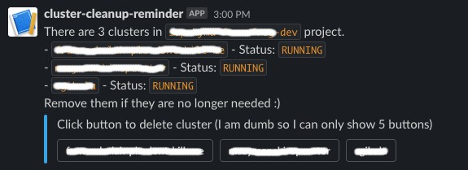

# GKE Cluster Cleanup Reminder

Quick and dirty Slack bot that reminds you to remove your GKE clusters.

[](https://deploy.cloud.run)

## Overview

If you frequently use GKE clusters for development purposes you may catch yourself that sometimes you forget to delete them after you finished working. This may generate unnecesary costs for you or your company.

This tool can help you by listing all running clusters directly to the Slack channel.




## Run Application

To run application set following environtment variables:
- `GOOGLE_APPLICATION_CREDENTIALS` - path to GCP Service Account (not required while running on Cloud Run)
- `GCP_PROJECT_NAME`
- `SLACK_BOT_USER_ACCESS_TOKEN`
- `SLACK_SIGNING_SECRET`

Install dependencies:
```
pip install -r requirements.txt
```

Run:
```
python3 app/cleanup-reminder.py
```
